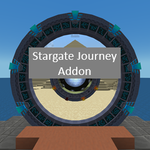

# Stargate Journey Addon
This is my first and only mod which I made for a modpack I made for my friends and family.
It is based off of the Stargate Journey mod with pieces from the Stargate Journey: MoreGates Addon mod
and the Mining Dimension datapack.

All of the changes and additions are made for me and my groups experience and
I didn't make it with the idea that anyone else would use it or want to use it.

## Changes
+ Added various stargate variants:
  + Universe
    + Nether
    + Create \(Requires [Create](https://www.curseforge.com/minecraft/mc-mods/create)\)
  + Milky Way
    + Mossy
    + Forest
    + Nether
    + End
    + Create \(Requires [Create](https://www.curseforge.com/minecraft/mc-mods/create)\)
    + Industrial \(Requires [Create](https://www.curseforge.com/minecraft/mc-mods/create)\)
    + Twilight Forest \(Requires [The Twilight Forest](https://www.curseforge.com/minecraft/mc-mods/the-twilight-forest)\)
  + Pegasus
    + Nether
    + Hyrule \(WIP\) \(Requires [Legendary Armory](https://www.curseforge.com/minecraft/mc-mods/legendary-armory)\)
+ Added space locations and stargate generation for:
  + [The Twilight Forest](https://www.curseforge.com/minecraft/mc-mods/the-twilight-forest)
  + [The Cat Dimension](https://www.curseforge.com/minecraft/mc-mods/the-cat-dimension)
  + [Mining Dimension](https://www.curseforge.com/minecraft/data-packs/mining-dimension)
+ Changed various galaxy and solar system details:
  + The End is only in the Milky Way and uses its symbols.
  + The Overworld is just a regular Milky Way solar system instead of Terra.
  + The Cat Dimension is now Terra.
+ Unrandomized the point of origin generation when new stargates are built. New stargates will now always have the dimension's point of origin.
+ Changed the Nether Temple structure to use the universe stargate Nether variant and use a universe DHD.
+ Changed the End Pedestal structure to use the Milky Way stargate End variant and include a Milky Way DHD.
+ Added the Mining Dimension.

### FAQ
+ If this mod is just for personal use, why upload it?
  + Because it is a lot easier for curseforge to manage the mod instead of having to manually transfer the files locally.
+ Why isn't the Overworld the Terra address anymore?
  + Because I felt the creeper point of origin made more sense for the Overworld.
+ So why is The Cat Dimension the Terra address now?
  + Because _something_ had to be Terra/Earth. My headcannon is that the cat dimension was originally Earth, the cats took over,
and the Goa'uld had to flee and start over with humanity in the overworld.
Which would explain why the TV show never mentioned or explained the Egyptians/Goa'uld fascination with cats.
+ What's going on with the Hyrule stargate variant?
  + I believe that Legendary Armory is the best Zelda mod currently out there. Unfortunately, it's only on 1.20.1 right now.
However, I have hope that it will eventually be ported to 1.21.1 and so I have a variant ready for that.

## Credits
+ [Stargate Journey](https://www.curseforge.com/minecraft/mc-mods/sgjourney) by [Povstalec](https://www.curseforge.com/members/povstalec/projects)
+ [Stargate Journey: MoreGates Addon](https://www.curseforge.com/minecraft/mc-mods/more-gates-mod-ver) by [Aspect_Xero](https://www.curseforge.com/members/aspect_xero/projects)
+ [Mining Dimension](https://www.curseforge.com/minecraft/data-packs/mining-dimension) by [Blizzor](https://www.curseforge.com/members/blizzor/projects)
